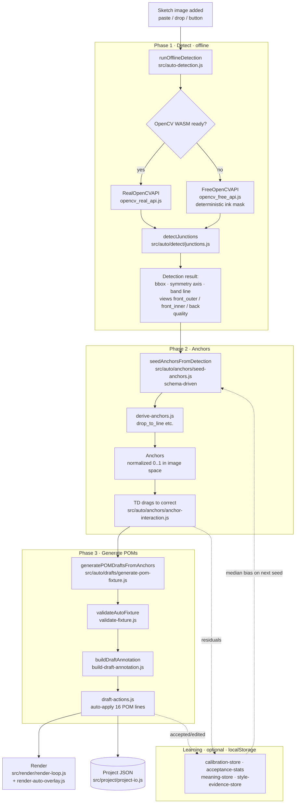

# Architecture — Bra Auto Measure

_The project map. How the pieces fit, how data flows, and how the app is
built. For **why** the project exists see [`PROJECT_CHARTER.md`](PROJECT_CHARTER.md);
for **what** it measures see [`POMS_CONTRACT.md`](POMS_CONTRACT.md); for
**how to run it** see [`README.md`](README.md)._

---

## 1. One-paragraph overview

The app is a single-page, fully offline browser tool. `index.html` holds the
layout, CSS, and the `<script>` tags; `app.js` holds all logic. `app.js` is
**generated** — it is the concatenation of ~50 files under `src/` (plus the
rule JSON, inlined) produced by `npm run build`. At runtime the app takes a
bra sketch image and runs it through three offline phases — **detect → seed
anchors → generate POMs** — wrapped by an optional **learning** layer and a
**local persistence** layer. Nothing is sent to a server.

## 2. Runtime load order (`index.html`)

Scripts load in this order before the app boots:

1. `opencv_free_api.js` — dependency-free fallback vision API (`FreeOpenCVAPI`).
2. `vendor/opencv-4.x-20260603.js` — pinned OpenCV.js WASM (~11 MB, WASM
   embedded), loaded `async` so it never blocks first paint and detection stays
   offline.
3. `opencv_real_api.js` — wrapper (`RealOpenCVAPI`) over the vendored WASM
   build; if it is still compiling or unavailable, `getCvApi()` transparently
   falls back to `FreeOpenCVAPI`.
4. `potrace.js` — raster-to-vector tracing helper.
5. `app.js` — the built bundle; its final line calls `init()`.

Fixed rule data is loaded by `src/auto/rules/load-rules.js` from
`auto_mode_rules/*.json` at startup, with the build-time **inlined** copy
(`BUILTIN_AUTO_MODE_RULE_JSON`) as a fallback when the JSON can't be fetched
(e.g. `file://`).

## 3. The pipeline (data flow)



The three phases correspond directly to the schema and rules: detection
produces a bbox and a **view classification** (`front_outer` / `front_inner` /
`back`); seeding walks `anchor-schema.json` to place each anchor (some are
_derived_, e.g. `drop_to_line` projects a point vertically onto the band line);
generation reads anchor positions and emits the 16 POM rows defined in
`pom-template.json`. Anchors are stored in **normalized `[0,1]` image space**
so they survive pan, zoom, resize, and save.

## 4. Module map (`src/`)

`src/` is grouped by role. Order of concatenation is declared once in
[`scripts/source-parts.mjs`](scripts/source-parts.mjs) — parts share one IIFE
scope, so a part must appear after anything it references.

| Group | Files | Responsibility |
|---|---|---|
| **Rules & state** | `auto/rules/load-rules.js`, `state.js` | Load rule JSON; hold global app state; boot into Auto Mode. |
| **Geometry** | `curves.js`, `geometry/math.js` | Curve and vector math shared across phases. |
| **Detection** | `auto-detection.js`, `auto/detect/junctions.js` | Offline image analysis; view classification; junction/endpoint/corner detection. |
| **Anchors** | `auto/anchors/seed-anchors.js`, `derive-anchors.js`, `anchor-interaction.js` | Seed anchors from detection; derive dependent anchors; drag/reset interaction. |
| **Drafts (POM gen)** | `auto/drafts/generate-pom-fixture.js`, `build-draft-annotation.js`, `validate-fixture.js`, `draft-actions.js` | Anchors → 16-row fixture → validated → draft annotations → applied. |
| **Learning** | `auto/learning/calibration-store.js`, `acceptance-stats.js`, `meaning-store.js`, `style-evidence-store.js` | Residual calibration (median bias), accept/edit stats, (style,POM) meanings, TD-edit evidence. All local. |
| **Telemetry** | `auto/telemetry/session-stats.js`, `session-timer.js` | Detect-to-POM timing/session summaries. |
| **Auto mode** | `auto/mode.js`, `auto/debug-api.js` | Mode switching (Auto ↔ Manual); expose `window.__braAutoModeDebug` test hooks. |
| **Project** | `project/project-io.js`, `history.js`, `autosave.js`, `project-library.js` | Save/open JSON (projects with applied lines reopen in Manual Mode); undo history; debounced autosave; library. |
| **Render** | `render/render-loop.js`, `render-auto-overlay.js`, `render-annotations.js`, `render-images.js`, `render-stitches.js`, `render/copy-image.js`, `hit-testing.js` | Canvas draw loop, auto overlay, annotations, hit-testing. `copy-image.js`: Copy Image — renders the whole board (sketch + lines/labels, content bounds) to an offscreen canvas and puts a PNG on the clipboard, offline. |
| **UI** | `ui/bindings.js`, `spec-panel.js`, `toast.js`, `meaning-popover.js`, `ui/dialogs/*` | DOM wiring, measurements panel, toasts, dialogs. |
| **Manual** | `manual/*`, `manual-tools.js`, `import/pptx.js`, `render/export-pdf.js`, `render/export-xlsx.js` | Manual editing toolset (drag/reshape, shortcuts, copy/paste, reflect, styles, export); hidden in Auto, active after the post-Apply handoff or via the mode toggle. `export-xlsx.js`: Export Excel — writes the Measurement Spec `.xlsx` (16 POM rows, 14-column graded size run per `Grading rules.md`, board PNG embedded) with a hand-rolled STORE-method ZIP writer, fully offline. |

## 5. The mode contract (Auto-first, Manual handoff)

This is a fork of the "How to measure1" assistant. It boots **Auto-first**, and
after "Apply Lines" it hands off to **Manual Mode** so the TD can correct the
applied lines (see `docs/decisions/0008-reenable-manual-mode.md`). The mode
behaviour is deliberately localized:

- `auto/mode.js` — `setAppMode()` / `requestAppModeChange()` switch between
  `'auto'` and `'manual'`.
- `state.js` — boots via `setAppMode('auto')`; initial state is auto.
- `auto/drafts/draft-actions.js` — after the atomic commit in
  `applyApprovedDraftsAtomically`, switches to Manual Mode.
- `project/project-io.js` — reopened projects that contain applied lines open
  in Manual Mode.
- `auto/drafts/generate-pom-fixture.js` — Generate auto-applies (no per-row
  approval on a clean apply); tests keep the review path via the
  `keepDraftsForReview` option.
- `index.html` — manual controls carry the `manual-only` class, hidden only in
  Auto (`body.app-auto`); the Manual/Auto toggle is visible in both modes.
- `render/copy-image.js` — Copy Image (toolbar button / `⌘⇧C`): whole board →
  PNG to the clipboard, fully offline.

The Approve / Review-Only / Apply / Discard controls only surface when an
auto-apply fails (e.g. duplicate POM rows on one image), so drafts stay on the
board for row-by-row resolution.

## 6. Build model

```
src/*.js  (order: scripts/source-parts.mjs)
   +  auto_mode_rules/*.json  (inlined as BUILTIN_AUTO_MODE_RULE_JSON)
   ─────────────────────────────────────────────  npm run build
                    │   (scripts/build-app.mjs wraps parts in one IIFE,
                    │    parse-validates with `new Function`, appends init())
                    ▼
                 app.js  ──loaded by──▶  index.html
```

**Never edit `app.js` directly** — it is regenerated and your change would be
lost. Edit the relevant `src/*` part, then `npm run build`. `npm run check`
rebuilds and parse-validates every part in isolation plus the standalone
`opencv_*` / `potrace` files.

## 7. Data & persistence

- **Rule data** (`auto_mode_rules/`): `pom-template.json` (the 16 POMs, EN + ZH
  labels, anchor pairs, pairing, confidence tiers), `anchor-schema.json` (anchor
  kinds, groups, hints, derivations), `version.json` (template/rule/anchor
  versions). These are the versioned contract; the learning loop never edits them.
- **Project files**: JSON via `project-io.js` — the durable artifact a user saves.
- **Local browser storage** (`localStorage`): learning buckets
  (`bra.learning.v1`), acceptance stats (`bra.autoAcceptance.v1`), meanings,
  style evidence, and autosave. All device-local; clearing it resets learning.

## 8. Key invariants (things that must stay true)

- Anchors are always normalized `[0,1]` in source-image pixel space.
- Every POM belongs to exactly one review/apply placement view (`front_outer` /
  `front_inner` / `back`). POM 14 is the measurement-path exception:
  `view: front_to_back`, placed for review as `placementViewRole: back`.
- The 16-POM set is fixed and versioned; changing it is a contract change.
- Learning is **optional, measurable, resettable**, and never mutates rule JSON.
- No network call carries sketch or measurement data (offline by design).
- `app.js` is generated output, not source.

See [`TESTING.md`](TESTING.md) for the suites that guard these.
