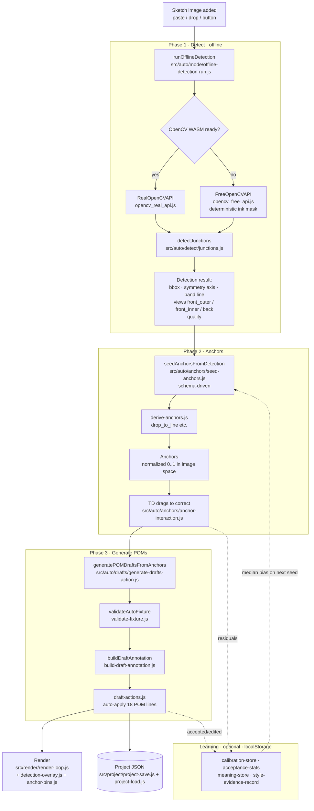

# Architecture — Bra Auto Measure

_The project map. How the pieces fit, how data flows, and how the app is
built. For **why** the project exists see [`PROJECT_CHARTER.md`](PROJECT_CHARTER.md);
for **what** it measures see [`POMS_CONTRACT.md`](POMS_CONTRACT.md); for
**how to run it** see [`README.md`](README.md)._

---

## 1. One-paragraph overview

The app is a single-page, fully offline browser tool. `index.html` holds the
layout, CSS, and the `<script>` tags; `app.js` holds all logic. `app.js` is
**generated** — it is the concatenation of ~150 single-concern files under
`src/` (plus the rule JSON, inlined) produced by `npm run build`. At runtime the app takes a
bra sketch image and runs it through three offline phases — **detect → seed
anchors → generate POMs** — wrapped by an optional **learning** layer and a
**local persistence** layer. Nothing is sent to a server.

## 2. Runtime load order (`index.html`)

Scripts load in this order before the app boots:

1. `vendor/opencv_free_api.js` — dependency-free fallback vision API (`FreeOpenCVAPI`).
2. `vendor/opencv-4.x-20260603.js` — pinned OpenCV.js WASM (~11 MB, WASM
   embedded), loaded `async` so it never blocks first paint and detection stays
   offline.
3. `vendor/opencv_real_api.js` — wrapper (`RealOpenCVAPI`) over the vendored WASM
   build; if it is still compiling or unavailable, `getCvApi()` transparently
   falls back to `FreeOpenCVAPI`.
4. `vendor/potrace.js` — raster-to-vector tracing helper.
5. `app.js` — the built bundle; its final line calls `init()`.

Fixed rule data is loaded by `src/auto/rules/load-rules.js` from
`auto_mode_rules/*.json` at startup, with the build-time **inlined** copy
(`BUILTIN_AUTO_MODE_RULE_JSON`) as a fallback when the JSON can't be fetched
(e.g. `file://`).

## 3. The pipeline (data flow)



The three phases correspond directly to the schema and rules: detection
produces a bbox and a **view classification** (`front_outer` / `front_inner` /
`back`); seeding walks `anchor-schema.json` to place each anchor (some are
_derived_, e.g. `drop_to_line` projects a point vertically onto the band line);
generation reads anchor positions and emits the 18 POM rows defined in
`pom-template.json`. Anchors are stored in **normalized `[0,1]` image space**
so they survive pan, zoom, resize, and save.

## 4. Module map (`src/`)

`src/` is grouped by role. Order of concatenation is declared once in
[`scripts/source-parts.mjs`](scripts/source-parts.mjs) — parts share one IIFE
scope, so a part must appear after anything it references.

| Group | Files | Responsibility |
|---|---|---|
| **Rules & state** | `auto/rules/load-rules.js`, `state.js`, `dom-refs.js`, `project/grade-rules.js`, `bootstrap.js`, `dev/url-bootstrap.js` | Load rule JSON; hold global app state (`state.js`); DOM element registry (`dom-refs.js`); grade-rules v2 + custom-POM data model (`project/grade-rules.js`); `init()`/vision-engine warm-up (`bootstrap.js`); `?label=`/`?project=`/`?autoDraft=` test-and-demo boot paths (`dev/url-bootstrap.js`). `state.js` must stay positioned right after `load-rules.js` — its top-level `const RULES = loadAutoModeRules();` runs at parse time, not hoisted. |
| **Geometry** | `curves.js`, `geometry/math.js` | Curve and vector math shared across phases. `curves.js` also owns the curved-line data model, whose floor is the pen-tool single cubic and whose ceiling is that same cubic grown with any number of *optional* interior anchor points ([US-093 / ADR 0053](docs/decisions/0053-curved-lines-grow-extra-anchor-points-on-demand.md)): `getCurveBeziers` is the one place a curve is walked into segments, so an absent/empty `points` array draws byte-identical to the two-handle model; `insertCurveAnchorAt` splits a segment by De Casteljau, which is what lets "Add point" insert an anchor without moving the drawn path, while `deleteCurveAnchorAt` deliberately has no exact inverse; `parseCurveAnchorPart`/`getAnnPartPoint` are the only parser of the `point<i>.point` / `point<i>.handleIn` / `point<i>.handleOut` part names, so drag/nudge/readout/delete code never hand-rolls the string format; `mirrorOppositeCurveHandle` re-smooths an anchor on every plain handle drag (Alt-drag skips it to break the pairing). The gesture that inserts one lives with the other click-to-draw tools, in `manual/canvas-tools.js`. |
| **Detection** | `auto-detection.js` (the ~180-line stage composer) + `auto/detect/*`: `math-utils.js`, `ink-mask.js`, `view-boxes.js`, `segmentation.js`, `potrace-trace.js`, `geometry-stage.js`, `front-landmarks.js`, `cup-model.js`, `back-landmarks.js`, `pom6-cradle-cf.js`, `pom7-cradle-cup.js`, `cv-debug-payload.js`, `landmark-stage.js`, `junctions.js`, `landmark-qa.js`; edge glue in `auto/mode/offline-detection-run.js` | Offline image analysis, laid out as the pipeline it describes: Stage 2 segmentation → Stage 3 contours/topology → Stage 4 geometry (`geometry-stage.js`) → Stage 5 landmarks (`landmark-stage.js`, one readable sequence of calls into the per-feature finders). The two most heavily tuned seam detectors get their own files — `pom6-cradle-cf.js` (gore-dip + placket-junction tiers) and `pom7-cradle-cup.js` (strong/seam/guide/arc tiers, ADR 0021/0022) — so a tuning pass on one never wades through the other. `offline-detection-run.js` holds everything DOM/state-mutating (toasts, `state.autoMode.*`, the view-role dialog, aux-view recognition), keeping the stage files pure. |
| **Anchors** | `auto/anchors/seed-view-resolution.js`, `seed-cradle-cf.js`, `seed-cup-width.js`, `seed-front-view.js`, `seed-back-view.js`, `seed-anchors.js` (orchestrator), `derive-anchors.js`, `anchor-visibility.js`, `anchor-interaction.js` | Seed anchors from detection as a composed sequence — resolve views → CF cradle geometry (POM 6/8) → cup geometry (POM 9/10, ADR 0036) → front branch → back branch → QA gate → record assembly + learning bias. Each stage is a pure function over an explicit `seedCtx`. Then derive dependent anchors, and drag/nudge/snap (`anchor-interaction.js`) separately from per-anchor show/hide (`anchor-visibility.js`, US-038). |
| **Drafts (POM gen)** | `auto/drafts/view-role-helpers.js`, `pom-fixture-builder.js`, `anchor-drag-sync.js`, `generate-drafts-action.js`, `build-draft-annotation.js`, `validate-fixture.js`, `apply-drafts.js`, `draft-actions.js`, `board-reset.js` | Anchors → 18-row fixture → validated → draft annotations → applied. `pom-fixture-builder.js` is the measurement-rules engine (anchors in, rows out); `generate-drafts-action.js` the UI orchestration around it; `apply-drafts.js` the one path that mutates `state.annotations` in Auto Mode; `board-reset.js` the whole-board lifecycle operations. Note the apex-slant limit (0.06) is duplicated by design in `pom-fixture-builder.js`, `anchor-drag-sync.js`, and `detect/front-landmarks.js` — kept in lockstep by hand. |
| **Measurement (Mode B)** | `auto/measure/fusion.js` | Library × sketch fusion ([ADR 0033](docs/decisions/0033-mode-b-library-sketch-fusion.md), ported from the lab engine by US-039): turn a detected anchor pair into a POM *value* by fitting one robust view-local scale from all of that view's sketch-reliable POMs (front never shares back), then precision-weighted **shrinkage** of the sketch length toward the library median — never a blind average, never assigned, and a conflicted POM falls back to the library value rather than showing a wrong number. Pure and side-effect-free; `ui/spec-values.js` is its only caller, which is why the part sits immediately before the `spec-*` parts. **Off by default**: `MODE_B_DEFAULT` plus the empty per-POM promotion list `MODE_B_ENABLED_POMS` (US-041) leave it fully inert, so shipped behaviour stays bit-identical to the Tier-0 library values; adding a POM to that list is a reviewed promotion step, gated on the measurement-accuracy run beating library-only, and it never touches the versioned contract JSON. |
| **Learning** | `auto/learning/calibration-store.js`, `shadow-detection.js`, `acceptance-stats.js`, `meaning-store.js`, `meaning-commit.js`, `style-evidence-record.js`, `style-evidence-capture.js`, `style-evidence-reuse.js` | Residual calibration (median bias, `calibration-store.js`) + shared shadow-redetect utilities (`shadow-detection.js`); accept/edit stats; (style,POM) meaning catalog (`meaning-store.js`) + the manual-line-to-meaning workflow spanning all three stores (`meaning-commit.js`); TD-edit style evidence — durable store (`style-evidence-record.js`), save-time capture (`style-evidence-capture.js`), generate-time reuse/bias (`style-evidence-reuse.js`). All local. |
| **Telemetry** | `auto/telemetry/session-stats.js`, `session-timer.js` | Detect-to-POM timing/session summaries. |
| **Auto mode** | `auto/mode.js`, `auto/debug-api.js`, `auto/debug-export.js` | Mode switching (Auto ↔ Manual); `debug-api.js` is just the `window.__braAutoModeDebug` object literal — the export/summary builders it calls (ground truth, CV debug, stage summary) live in `debug-export.js`. |
| **Project** | `project/history.js`, `project-save.js`, `project-load.js`, `autosave.js`, `project-library.js`, `ui/dialogs/autosave-restore-banner.js` | Undo history; save/open JSON (`project-save.js`/`project-load.js` — projects with applied lines reopen in Manual Mode); debounced autosave engine (`autosave.js`) + its restore-banner UI (`ui/dialogs/autosave-restore-banner.js`); library. |
| **Render** | `render/viewport.js`, `render/render-loop.js`, `render/detection-overlay.js`, `render/anchor-pins.js`, `render-annotations.js`, `render-images.js`, `render-stitches.js`, `render/render-notes.js`, `render/copy-image.js`, `hit-testing.js` | Pointer/viewport math (`viewport.js`); canvas draw loop (`render-loop.js`); read-only detection diagnostic overlay (`detection-overlay.js`); draft lines + draggable anchor pins (`anchor-pins.js`); annotations, hit-testing. `render-notes.js`: paints Board text notes — the box, the prose, and each leader as a line plus an arrowhead and nothing else (the Construction/BOM callouts add a numbered disc; a note belongs to no table and has no number). It draws entirely in **world** coordinates sized off the note's own `fontSize`, so a note scales with the sketch the way ink does instead of holding a constant *screen* size the way POM lines and callout numbers do — which is what makes the export paths free: `copy-image.js` and `export-pdf.js` redirect the global `ctx` and re-run this same code with no zoom compensation ([US-092 / ADR 0052](docs/decisions/0052-notes-are-the-boards-third-object.md)). `copy-image.js`: Copy Image — renders the whole board (sketch + lines/labels, content bounds) to an offscreen canvas and puts a PNG on the clipboard, offline. |
| **UI** | `ui/bindings.js`, `ui/label-editor.js`, `spec-panel.js` (+ `spec-values.js`, `spec-row-builders.js`, `spec-visibility.js`, `anchor-manager-panel.js`), `main-page.js` (+ `main-page-data/-sketches/-fields/-colorways.js`), `ui/construction-phrase-data.js`, `ui/construction.js` (+ `construction-state/-images/-canvas/-rows.js`), `ui/bom-material-data.js`, `ui/bom.js` (+ `bom-state/-materials/-images/-canvas/-table.js`), `ui/preview-page.js`, `ui/page-nav.js`, `ui/board-toolbar.js`, `ui/note-editor.js`, `toast.js`, `ui/dialogs/*` | DOM wiring, measurements panel, toasts, dialogs. Each of the three table-and-canvas tech-pack pages (MAIN PAGE, Construction, BOM) follows the same shape: a `*-state.js`/`*-data.js` layer, an images layer, a canvas/leader-line engine, a table/rows layer, and a thin orchestrator keeping the page's `ensureX`/`renderX`/`initX` entry points. The measurements panel splits the same way: `spec-values.js` (value model — suggestions, fraction math, `state.pomSpecs`), `spec-row-builders.js` (row/cell DOM), `spec-visibility.js` (per-POM line hiding), with `spec-panel.js` the orchestrator that owns the one `specPanelFingerprint` rebuild guard. `main-page.js`: the tech pack MAIN PAGE sheet — style metadata, suggestion pickers, colorways, printable page. Style metadata only: no anchor, no POM, so detection never reads it ([ADR 0037](docs/decisions/0037-main-page-sheet-port.md)). `construction.js` (+ `construction-phrase-data.js`'s ported phrase/term library): the Construction annotation page — numbered callout notes with leader lines dropped onto the board's own sketch images, plus a quick-search phrase panel; a note's `targets`/`textPos` are normalized to its *owning image's own rect*, a different convention from the anchor `[0,1]`-of-whole-image one. Metadata only: no anchor, no POM, so detection never reads it ([ADR 0039](docs/decisions/0039-construction-annotation-page.md)). Notes also carry a `variant` (`'solid'`/`'lace'`, toolbar-tab-scoped rendering + independent per-variant `seq` numbering), a `zone` (the 7-value `CC_ZONES` garment taxonomy, keyword-defaulted, purely descriptive — nothing downstream reads it), and `targets` (1+ anchors per note; leader lines are drawn from the label box's own edge to each anchor with an arrowhead, and a double-click on one anchor removes just that leader line) ([ADR 0040](docs/decisions/0040-construction-lace-solid-leader-lines.md)). `bom.js` (+ `bom-material-data.js`'s ported 27-material suggestion library): the BOM page — a shared FABRIC/TRIM row list (`scope`: `BOTH`/`SOLID`/`LACE`, same toolbar-tab convention as Construction's variants) rendered as an editable table with one column per `state.mainPage.colorways` entry (finally consuming what ADR 0037 called "knowingly inert"), plus a "material key" canvas annotation that forks Construction's exact multi-anchor/edge-leader-line/arrowhead/double-click-delete engine under a `bm*` prefix to place numbered callouts, linked to table rows, on the board's own sketch images. A project's *first-ever* BOM materializes as the reference factory sheet's exact 12-row BOM (`BM_SEED_ROWS`, verbatim from `Tech pack Output/TechPack output.html`'s `#pack-data` `bom.rows`; one-shot, guarded by `bom.seedId` so a TD-emptied table stays empty — US-074). Metadata only: no anchor, no POM, so detection never reads it ([ADR 0041](docs/decisions/0041-bom-annotation-and-table.md)). `preview-page.js`: the Preview & Export page — the whole tech pack as six A4 sheets stacked in the fixed contract order (MAIN PAGE portrait, CONSTRUCTION SOLID and LACE landscape, BOM-SOLID and BOM-LACE portrait, POM / How to Measure landscape), each with an include checkbox persisted in the project (`state.preview.enabledPages`) that also decides which sheets "Export Tech Pack (.xlsx)" writes. Preview fidelity is deliberately *content on paper*, not an Excel-pixel simulation: cell-based sheets render as paper-styled DOM over the same live state the workbook reads, and the two Construction sheets are drawn by `ccRenderSheetToCanvas` — the very function whose output the workbook embeds ([US-079 / ADR 0046](docs/decisions/0046-preview-export-tab-multisheet-workbook.md)). `page-nav.js`: the tab bar that switches between tech-pack pages — five `TECH_PACK_PAGES` entries today (Board, MAIN PAGE, Construction, BOM, Preview & Export) — and owns that one registry plus `state.activePage` (session-only, like `state.selectedImageIds`); a new page means one entry here and a content element for it to show/hide, nothing else ([ADR 0038](docs/decisions/0038-page-navigation-model.md)). `board-toolbar.js`: the contextual Board toolbar (US-082) — presentation and dropdown-menu behaviour *only*, never an execution path: the original command buttons and their existing bindings stay the single way any action runs. It owns `BOARD_TOOLBAR_MENUS`, the one registry a new toolbar dropdown must be added to (wrap/button/list element ids), which is what keeps outside-click, Escape, focus return and `aria-expanded` handling generic — US-093 folded Straight/Curved/Eraser/Text into a single `toolsMenu` entry there to free a toolbar slot for "Add point". `note-editor.js`: the floating `<textarea>` that places a new Board text note or re-opens an existing one. It is a separate editor from `label-editor.js` by design — a POM callout label is one short token, so its single-line `<input>` *commits* on Enter, whereas a note is prose, so Enter must insert a newline and the commit moves to ⌘/Ctrl+Enter (Escape cancels, click-away commits). The record and its geometry live in `manual/note-model.js` and drawing in `render/render-notes.js`; a note is **not** an annotation, so nothing in the measurement path ever reads one — that separation is the whole point of [ADR 0052](docs/decisions/0052-notes-are-the-boards-third-object.md) (US-092), since the pre-US-092 habit of typing into a line's label turned every remark into a POM row in the exported workbook. |
| **Manual** | `manual/*` (`selection.js`, `pointer-events.js`, `touch-input.js`, `canvas-tools.js`, `line-nudge.js`, `keyboard-shortcuts.js`, `ui-status.js`, `image-import.js`, `annotation-*.js`, `label-layout.js`, …), `import/*`, `ui/dialogs/pptx-picker-dialog.js`, `render/export-pdf.js`, `render/export-xlsx-grading.js`, `render/xlsx-writer.js`, `render/export-spec-xlsx.js`, `render/export-techpack-xlsx.js` | Manual editing toolset (drag/reshape, shortcuts, copy/paste, reflect, styles, export); hidden in Auto, active after the post-Apply handoff or via the mode toggle. Input is layered: `selection.js` (what is picked) → `pointer-events.js` (the canvas pointer state machine and every drag session) → `touch-input.js` (US-036 touch/pen, routed into the same mouse handlers) → `canvas-tools.js` (eraser, click-to-draw, and the US-093 "Add point" click that inserts an interior anchor at the nearest point *on* the selected curve's path), with `keyboard-shortcuts.js` and `line-nudge.js` (US-027) on top and `ui-status.js` owning `updateUI()`. Export Excel — writes the Measurement Spec `.xlsx` (18 POM rows, 14-column graded size run per `Grading rules.md`, board PNG embedded) with a hand-rolled STORE-method ZIP writer, fully offline: grading math (`export-xlsx-grading.js`), the generic OOXML+ZIP toolkit (`xlsx-writer.js`), the single-sheet export incl. `buildSpecSheetRows` — the one shared builder the tech-pack workbook also calls (`export-spec-xlsx.js`), and the 6-sheet tech-pack workbook (`export-techpack-xlsx.js`). |

## 5. The mode contract (Auto-first, Manual handoff)

This is a fork of the "How to measure1" assistant. It boots **Auto-first**, and
after "Apply Lines" it hands off to **Manual Mode** so the TD can correct the
applied lines (see `docs/decisions/0008-reenable-manual-mode.md`). The mode
behaviour is deliberately localized:

- `auto/mode.js` — `setAppMode()` / `requestAppModeChange()` switch between
  `'auto'` and `'manual'`.
- `bootstrap.js` — `init()` boots via `setAppMode('auto')`; initial state is auto.
- `auto/drafts/draft-actions.js` — after the atomic commit in
  `applyApprovedDraftsAtomically`, switches to Manual Mode.
- `project/project-load.js` — reopened projects that contain applied lines open
  in Manual Mode.
- `auto/drafts/generate-drafts-action.js` — Generate auto-applies (no per-row
  approval on a clean apply); tests keep the review path via the
  `keepDraftsForReview` option.
- `index.html` — manual controls carry the `manual-only` class, hidden only in
  Auto (`body.app-auto`); the Manual/Auto toggle is visible in both modes.
- `render/copy-image.js` — Copy Image (toolbar button / `⌘⇧C`): whole board →
  PNG to the clipboard, fully offline.

The Approve / Review-Only / Apply / Discard controls only surface when an
auto-apply fails (e.g. duplicate POM rows on one image), so drafts stay on the
board for row-by-row resolution.

## 6. Build model

```
src/*.js  (order: scripts/source-parts.mjs)
   +  auto_mode_rules/*.json  (inlined as BUILTIN_AUTO_MODE_RULE_JSON)
   ─────────────────────────────────────────────  npm run build
                    │   (scripts/build-app.mjs wraps parts in one IIFE,
                    │    parse-validates with `new Function`, appends init())
                    ▼
                 app.js  ──loaded by──▶  index.html
                    │                        ▲
                    └── content hash ────────┘
                        (app.js?v=<hash> cache-buster, kept in sync)
```

**Never edit `app.js` directly** — it is regenerated and your change would be
lost. Edit the relevant `src/*` part, then `npm run build`.

`npm run check` is deliberately **read-only** — it never writes `app.js`.
Rebuilding inside `check` would mask a forgotten `npm run build`, which is the
exact failure that once shipped a stale bundle. Instead it asserts the committed
`app.js` still matches what `src/` would produce, parse-validates every part in
isolation plus the standalone `vendor/opencv_*` / `vendor/potrace` files,
verifies every `src/**/*.js` is registered in `source-parts.mjs` (an
unregistered part silently never ships), checks the rule-JSON contract, and runs
the two shared-scope gates described in §9.

The build also rewrites the `<script src="app.js?v=…">` cache-buster in
`index.html` to a **content hash of the bundle**. This is what makes a shipped
fix actually reach browsers: a static `?v=` served every rebuild's fresh
`app.js` under the same URL, so browsers and the GitHub Pages CDN kept serving
the stale cached copy. The hash changes only when `app.js` changes, and
`npm run check` fails if `index.html`'s buster is out of sync — so `index.html`
is a build output too, not hand-edited for the version string.

## 7. Data & persistence

- **Rule data** (`auto_mode_rules/`): `pom-template.json` (the 18 POMs, EN + ZH
  labels, anchor pairs, pairing, confidence tiers), `anchor-schema.json` (anchor
  kinds, groups, hints, derivations), `version.json` (template/rule/anchor
  versions). These are the versioned contract; the learning loop never edits them.
- **Project files**: JSON via `project-save.js`/`project-load.js` — the durable artifact a user saves.
- **Local browser storage** (`localStorage`): learning buckets
  (`bra.learning.v1`), acceptance stats (`bra.autoAcceptance.v1`), meanings,
  style evidence, and autosave. All device-local; clearing it resets learning.

## 8. Key invariants (things that must stay true)

- Anchors are always normalized `[0,1]` in source-image pixel space.
- Every POM belongs to exactly one review/apply placement view (`front_outer` /
  `front_inner` / `back`). POM 14 is the measurement-path exception:
  `view: front_to_back`, placed for review as `placementViewRole: back`.
- The 18-POM set is fixed and versioned (extended 16 → 18 by ADR 0032);
  changing it is a contract change.
- Learning is **optional, measurable, resettable**, and never mutates rule JSON.
- No network call carries sketch or measurement data (offline by design).
- `app.js` is generated output, not source.
- No name is declared at top level in two parts, and nothing reads a
  `const`/`let`/`class` from a later part at load time (see §9).

## 9. Living in one shared scope

Every part is concatenated into a single IIFE, so all top-level declarations
land in **one shared scope** with no module boundary. That is what makes a bare
`showToast(...)` work from anywhere, and it is also the source of two failure
modes that produce no syntax error and no stack trace. `npm run check` enforces
both (`validateSharedScope` in `scripts/check.mjs`):

1. **One declaration per name, bundle-wide.** Two `function foo(){}` in
   different parts is legal JS — the later silently replaces the earlier for
   *every* caller, so editing one copy appears to do nothing at all. This
   really happened: a duplicate `escapeHtml` in `spec-panel.js` shadowed the one
   in `dialogs/core.js` for the whole bundle.
2. **Cross-file symbols stay `function` declarations.** `function` and `var`
   hoist across the entire bundle, so a part may call something defined much
   further down — the codebase relies on this heavily and it is fine. `const`,
   `let` and `class` do **not** hoist: reading one before its own part has been
   evaluated throws a TDZ `ReferenceError`. Only load-time reads (brace depth 0)
   can hit this; a call inside a function body runs long after every part has
   been evaluated and is safe.

The practical rule when moving code between parts: keep it a `function`
declaration, and keep module-scope singletons (caches, timers, session objects)
in the same file as every function that touches them — two copies of a `let`
mean two independent singletons racing each other, silently.

A handful of top-level statements genuinely **do** run at load time and are
therefore order-sensitive: `const RULES = loadAutoModeRules()` in `state.js`
(hence it sits immediately after `auto/rules/load-rules.js`), the `el` DOM
registry in `dom-refs.js`, `MP_SHADE_RE`/`MP_FIELD_SPEC` in `main-page-data.js`,
and the `CONSTRUCTION_PHRASES` merge in `construction-rows.js`. Everything else
is hoisted and position-independent.

See [`TESTING.md`](TESTING.md) for the suites that guard these.
